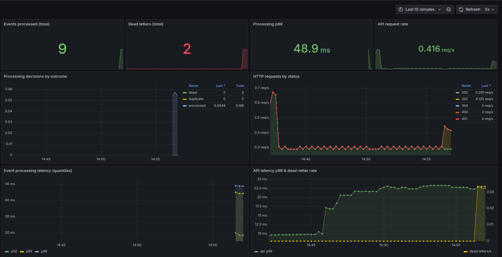

# Async Webhook Ingestion

Receives order webhooks from marketplace partners and processes them asynchronously.
The HTTP endpoint verifies the signature, publishes the event to RabbitMQ, and returns
`202` right away. A separate worker does the actual processing, so a slow downstream
never blocks a partner's request.

The design decisions behind this project (why RabbitMQ over BullMQ, why PostgreSQL as
the idempotency store, the publish-and-confirm trade-off, and so on) are explained in
detail on [my portfolio](https://matheusfinatto-portfolio.vercel.app).

## What it does

- **Signed ingestion.** Verifies an HMAC-SHA256 signature over the raw body, with a
  replay window and a timing-safe comparison. A bad or missing signature is rejected
  before anything is published.
- **Publish-and-confirm.** Returns `202` only after the broker confirms the publish, and
  `503` if it does not. Nothing is written to PostgreSQL on the hot path.
- **Idempotent consumer.** A repeated `event_id` takes effect exactly once, even under
  concurrent delivery, through a transactional insert on a unique index. The second
  delivery is recorded as a duplicate.
- **Retry and dead-lettering.** Transient failures are retried with a staged backoff
  (5s / 30s / 2min) via TTL-and-dead-letter queues; exhausted or poison messages land in
  a durable dead-letter queue.
- **DLQ inspection and replay.** `GET /dlq`, behind an admin key, lists dead-lettered
  messages. `POST /dlq/:id/replay` redrives one: it resets the event state, republishes
  the original message and restarts the retry budget, keeping the dead-letter row as an
  audit record with a `replayed_at` stamp.
- **Rate limiting.** A per-IP limit on the ingestion endpoint, counted before the HMAC
  check, so a flood of garbage cannot burn CPU on signature verification.
- **End-to-end tracing.** A `correlation_id` is propagated from the HTTP request through
  the AMQP message to the worker and into the persisted row, on structured JSON logs.
- **Prometheus metrics.** The API serves `GET /metrics` (HTTP series by route and
  status); the worker exposes its own registry (processing outcomes, durations, dead
  letters) on a dedicated port. The demo overlay bundles Prometheus and Grafana to scrape
  and chart them (see [Metrics dashboard](#metrics-dashboard)).
- **OpenAPI docs.** Swagger UI at `/docs`. Note that "Try it out" on the ingestion
  endpoint returns `401` by design: it cannot compute the HMAC signature. Use the signed
  `curl` below or `bench/latency-smoke.mjs` as a reference client.
- **Durable topology.** Exchanges and queues are declared and asserted on boot by both
  the API and the worker; messages are persistent so they survive a broker restart.

## Stack

NestJS · PostgreSQL · RabbitMQ · TypeORM · Docker Compose

Two processes run from one codebase; the role (`api` or `worker`) is chosen at startup
via `APP_ROLE`.

## Running

Requires Docker with the Compose plugin; nothing else needs to be installed for a
containerized run.

```bash
cp .env.example .env      # set WEBHOOK_HMAC_SECRET and ADMIN_API_KEY to real values
docker compose up         # postgres, rabbitmq, api, worker
```

Every setting in `.env.example` is documented inline and carries a sane default, so
editing the two secrets is enough to start.

The API listens on `http://localhost:3000`, with Swagger UI at
`http://localhost:3000/docs`. Migrations run on the API's boot. The worker's metrics
are published on `http://127.0.0.1:9091/metrics`.
The API **refuses to boot** without a non-empty `WEBHOOK_HMAC_SECRET` and
`ADMIN_API_KEY`. An empty HMAC secret would be fail-open, since anyone can
sign with the empty key.

Sending a signed webhook (the signature covers `"${timestamp}.${rawBody}"`):

```bash
SECRET="your-secret"
BODY='{"event_id":"order-123","event_type":"order.created","payload":{"amount":4200}}'
TS=$(date +%s)
SIG=$(printf '%s' "${TS}.${BODY}" | openssl dgst -sha256 -hmac "$SECRET" -r | awk '{print $1}')

curl -i -X POST http://localhost:3000/webhooks/orders \
  -H "content-type: application/json" \
  -H "x-timestamp: $TS" \
  -H "x-signature: $SIG" \
  --data "$BODY"
```

Inspecting the dead-letter queue and replaying an entry after the downstream is fixed:

```bash
curl -H "x-admin-key: $ADMIN_API_KEY" http://localhost:3000/dlq
curl -X POST -H "x-admin-key: $ADMIN_API_KEY" http://localhost:3000/dlq/<id>/replay
```

A replay is refused with `409` when it cannot succeed or would double-process: a dead
letter whose payload never parsed would only die again, and an event that is already
`processed` must not run twice.

## Live demo

A single-page visualizer in [`web/`](./web) shows the pipeline processing real events:
each scenario fires an actual signed `POST /webhooks/orders`, and every worker stage is
streamed to the browser over a WebSocket telemetry feed. It is opt-in and lives entirely
behind `DEMO_MODE`; with the flag off the ingestion path is byte-for-byte the base system
and the p99 above is preserved.

Everything demo-specific is in an override file. The base `docker-compose.yml` is
untouched, so `docker compose up` still brings up production behaviour.

```bash
docker compose -f docker-compose.yml -f docker-compose.demo.yml up --build
```

This requires **Docker Compose ≥ 2.24.4** (the override uses `!override` to replace the
published port rather than append to it). The API is published on `127.0.0.1:3000` only,
and the visualizer on `http://localhost:5173`.

The override turns on `DEMO_MODE`, drops `NODE_ENV` to `development` (the image ships
`production`, under which the demo refuses to boot), and maps two **public-by-design**
credentials onto the real env names the guards read:

- `DEMO_WEBHOOK_HMAC_SECRET` → `WEBHOOK_HMAC_SECRET` (default `demo-hmac-secret-public`)
- `DEMO_ADMIN_API_KEY` → `ADMIN_API_KEY` (default `demo-admin-key-public`)

These are demo values only. The browser signs with the same public secret through
WebCrypto, so the real HMAC guard runs and returns real `202` / `400` / `401`. No partner
secret is ever exposed to the browser.

The seven scenario buttons cover the happy path, an invalid signature, a stale timestamp,
a duplicate `event_id`, a transient failure that climbs the retry ladder, a permanent
failure that dead-letters, and a malformed body rejected at the validation pipe.

### Metrics dashboard

The `/metrics` endpoints are a plain Prometheus exposition format; on their own they are
just text. The demo overlay runs a Prometheus that scrapes both the API and the worker
and a Grafana that charts the result, so the counters and histograms are readable at a
glance. Both are demo-only and stay out of the base `docker-compose.yml`; a production
deployment exposes the same endpoints for whatever scraper you already run.

They come up with the demo stack. Grafana is on `http://localhost:3001` (login is
disabled on this local instance) with the "Webhook Ingestion" dashboard provisioned on
first boot; Prometheus is on `http://localhost:9090`. Set `GRAFANA_PORT` if `3001` is
already taken. Drive traffic from the scenario buttons and the worker panels fill in.



The panels read the same series the pipeline emits: events processed by outcome, the
running dead-letter count, HTTP requests by status, and both the processing and API
latency quantiles.

### Seeing a real 503

The `503` is not one of the buttons. It needs the broker down, which also takes the
telemetry feed and `GET /dlq` with it. Reproduce it manually:

```bash
docker compose -f docker-compose.yml -f docker-compose.demo.yml stop rabbitmq
# then click "Happy path" in the visualizer
```

The publish-and-confirm never gets its acknowledgement, so the API returns a real `503`.
The visualizer shows the response and drops into its "backend offline" state at the same
time, because the WebSocket feed and the DLQ endpoint both depend on RabbitMQ.

## Tests

```bash
npm test          # unit
npm run test:e2e  # end-to-end against Postgres and RabbitMQ (Testcontainers)
```

The visualizer has its own checks (`cd web`):

```bash
npm run typecheck && npm run lint && npm run build && npm test
```

## Latency

The ingestion endpoint targets a p99 under 100ms, measured locally. The
publish-and-confirm design puts the broker's acknowledgement on the response path, so
the number is real rather than aspirational.

Measured with `bench/latency-smoke.mjs` (2000 signed requests, 20 concurrent, after a
200-request warmup) against the API running natively over Postgres and RabbitMQ in
Docker, on Node.js 22:

| percentile | latency |
| ---------- | ------- |
| p50        | ~28 ms  |
| p95        | ~50 ms  |
| p99        | ~65 ms  |

Absolute numbers depend on the machine; reproduce with:

```bash
WEBHOOK_HMAC_SECRET="your-secret" RATE_LIMIT_MAX=10000 node bench/latency-smoke.mjs
```

`RATE_LIMIT_MAX` must be raised on the API process for the run: the smoke test fires
2000 requests from one IP, far past the production default.

## Architecture decisions

The reasoning behind the stack and the reliability semantics (broker choice, idempotency
store, publish-and-confirm versus latency, retry topology) is written up in depth on
[my portfolio](https://matheusfinatto-portfolio.vercel.app).
